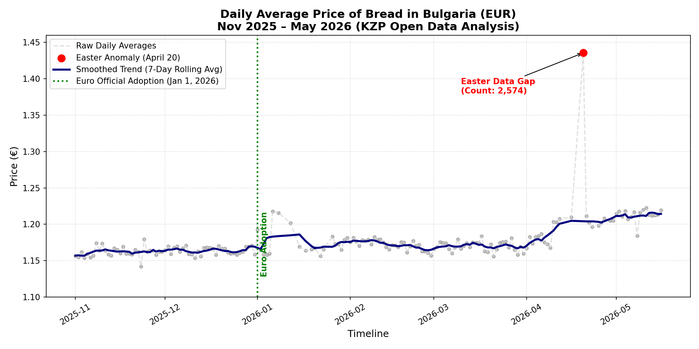
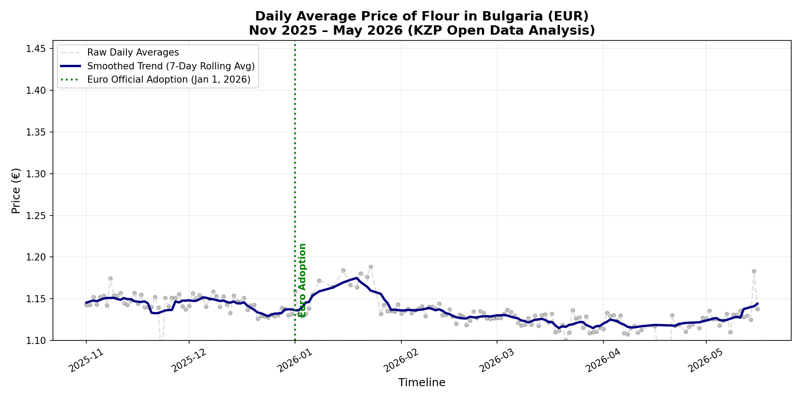
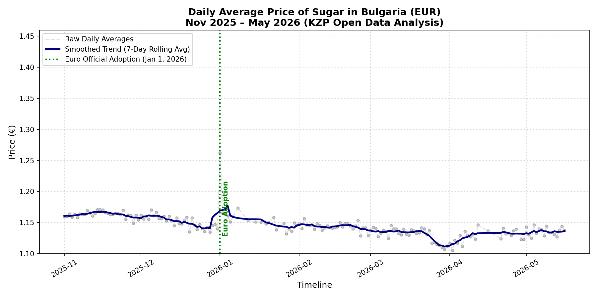

# PriceStat

A high-performance platform for tracking and analyzing pricing trends across Bulgarian retail and pharmaceutical sectors. PriceStat aggregates open data from [KZP](https://kolkostruva.bg/compare) (Commission for Protecting Consumers in Bulgaria) and processes enormous datasets to extract actionable insights on market dynamics.

## Overview

PriceStat processes **35GB+ of historical pricing data** collected daily from major Bulgarian retailers and pharmaceutical vendors including Lidl, Kaufland, Sopharmа, Billa, and others with substantial market presence (10M+ BGN annual reported profit). The platform combines the computational efficiency of Rust with the orchestration flexibility of Java to deliver a scalable, production-ready data pipeline.

## Key Features

- **High-Volume Data Ingestion**: Processes 250MB+ daily data exports from KZP in multiple inconsistent CSV formats
- **Intelligent Data Cleaning**: Handles malformed quotation marks and format inconsistencies across vendor datasets
- **Direct Database Integration**: Leverages tokio and tokio-postgres for zero-copy data streaming to PostgreSQL
- **FFI-Based Orchestration**: Java 25 with Foreign Function Interface (FFI) seamlessly coordinates Rust processing tasks
- **Production-Grade Build System**: Custom Gradle configuration with jextract and cbindgen for automatic C header compilation from Rust
- **Async-First Architecture**: Built on Tokio runtime for concurrent data processing and I/O operations

## Technology Stack

| Component | Technology | Purpose |
|-----------|-----------|---------|
| **Orchestration** | Java 25 + FFI | Coordinate data pipelines and system workflows |
| **Data Processing** | Rust | High-performance CSV parsing and transformation |
| **Async Runtime** | Tokio | Non-blocking I/O and concurrent task execution |
| **Database Access** | tokio-postgres | Async PostgreSQL driver for efficient data ingestion |
| **Build System** | Gradle (Custom Config) | Automated C header compilation (jextract, cbindgen) |
| **Database** | PostgreSQL | Primary data storage and analytical backend |
| **Infrastructure** | Docker | Containerized database and deployment environment |

## Project Statistics

- **Dataset Size**: 35GB+
- **Languages**: Rust (61.6%), Java (36%), Dockerfile (2.4%) (numbers are not indicative)
- **Data Sources**: 5+ major retailers + additional vendors (total 221)
- **Daily Processing**: ~250MB per data point

## Getting Started

### Prerequisites

- Java 25+
- Rust 1.70+
- PostgreSQL 13+
- Docker
- Gradle 8.0+

### Building

1. **Build Rust Binaries**

   ```bash
   ./gradlew build
   ```

   The custom Gradle configuration automatically:
   - Compiles Rust code with optimal flags
   - Generates C headers using cbindgen
   - Extracts Java bindings with jextract
   - Creates platform-specific native libraries

2. **Start PostgreSQL Database**

   ```bash
   docker build -f Dockerfile -t pricestat-db .
   docker run -d -p 5432:5432 pricestat-db
   ```

3. **Run the Pipeline**

   ```bash
   ./gradlew run
   ```

## Architecture Overview

### Data Pipeline Flow

```
KZP Open Data
   ↓
Java HTTP ZIP file quering and saving
   ↓
Java FFI Class that sends an Arena with the file path of the to be worked on ZIP
   ↓
Rust Ingestor (Tokio)
    ↓
CSV Validation & Cleaning
    ↓
Format Normalization
    ↓
tokio-postgres
    ↓
PostgreSQL Data Lake (35GB+)
```

### Key Components

**Rust Processing Layer**
- Asynchronous CSV ingestion using Tokio
- Intelligent quotation mark and format error recovery
- Streaming data transformation pipeline
- Direct PostgreSQL insertion via tokio-postgres

**Java Orchestration**
- FFI-based coordination of Rust tasks
- Workflow management and error handling
- Scheduling and monitoring

## Known Issues

- ⚠️ Test4.java causes system instability in certain environments (investigation ongoing), if you experience RAM issues I recommend adjusting the set Semaphor limit in the class 
- Performance considerations noted for 35GB+ dataset processing
- CSV format inconsistencies across vendor exports require custom parsing logic

## Contributing

PriceStat is actively seeking improvements and optimizations. Contributions are welcome, particularly:

- Performance enhancements for large-scale data processing
- Improved CSV parsing heuristics
- Query optimization for the data lake
- Infrastructure as Code improvements

Please open a pull request with your improvements or open an issue to discuss potential changes.

## Data Visualization

### Price of Bread Trend



### Price of Flour Trend



### Price of Sugar Trend



## License

[MIT]

## Contact

For questions or collaboration inquiries, please open an issue or contact me (OmegaSleepy).

---

## A note about my analysis
Prices are growing and the trends are there, my project is not aimed to be the next "app to check for the price of bread the last week". My goal with this project was and still is to experiment, learn and implement Rust to Java with FFI and I learned a lot. Do not expect this project to be updated or maintained, reproducability may varry. 
